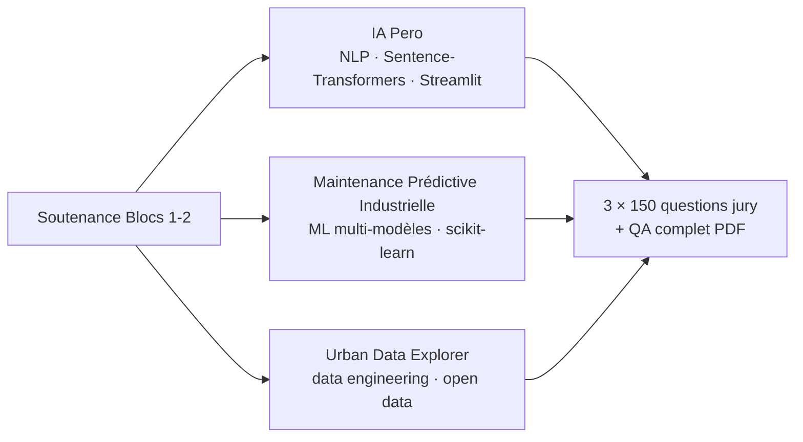

# Soutenance M1 · Blocs 1-2 · EFREI

<!-- adam-badges:start -->

<!-- adam-badges:end -->

Supports de soutenance du M1 Mastère Data Engineering & IA (EFREI · RNCP 40875),
blocs de compétences 1 et 2. Binôme Adam Beloucif & Emilien Morice.

## Contenu

| Fichier | Rôle |
|---------|------|
| `Soutenance_Bloc1-2_Adam_Emilien_v2.pptx` | Deck de soutenance (version finale) |
| `SOUTENANCE.md` · `PLAN_SLIDES.md` | Script oral + plan détaillé des slides |
| `QA_JURY.md` · `QA_JURY_COMPLET.pdf` | Préparation questions / réponses jury |
| `Soutenance_IAPero_150Q.pdf` | 150 questions · projet IA Pero (NLP, similarité sémantique) |
| `Soutenance_MPI_150Q.pdf` | 150 questions · projet Maintenance Prédictive Industrielle |
| `Soutenance_UDE_150Q.pdf` | 150 questions · projet Urban Data Explorer |
| `.preview/` | Rendus HTML + PNG de chaque slide (s01 → s23) |

## Projets couverts

Les dépôts de code correspondants ·
[ia-pero](https://github.com/Adam-Blf/ia-pero) ·
[maintenance-predictive-industrielle](https://github.com/Adam-Blf/maintenance-predictive-industrielle) ·
[urban-data-explorer](https://github.com/Adam-Blf/urban-data-explorer)

## Nature du dépôt

Dépôt de livrables (slides, scripts, préparation jury), pas de code applicatif.
Le code des projets vit dans les dépôts liés ci-dessus.
